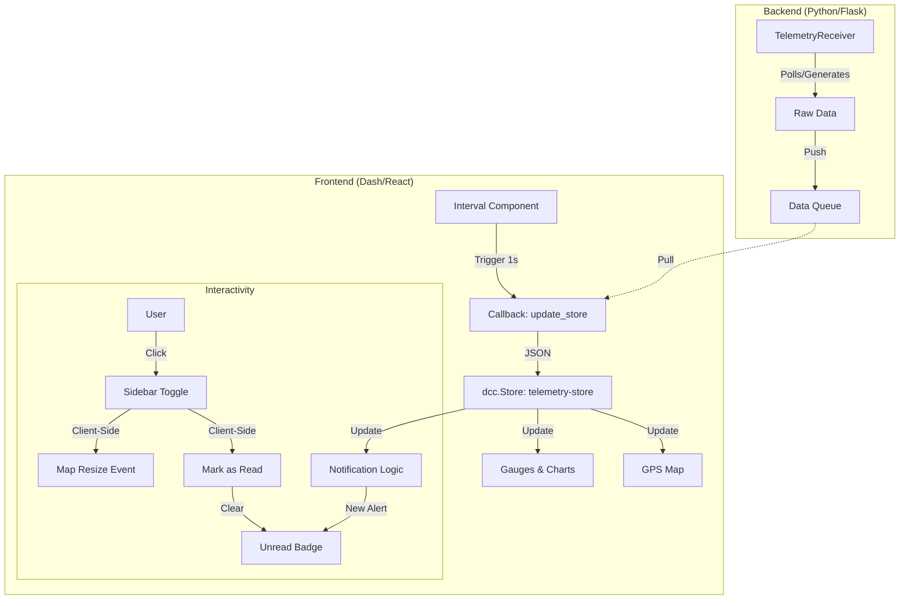

# Live Telemetry Dashboard Documentation

## 1. Architecture Overview
The dashboard is built using **Plotly Dash**, a Python framework for building analytical web applications. It follows a reactive programming model where the UI updates automatically in response to data changes.

- **Frontend**: Dash (React.js wrapper), HTML/CSS Grid & Flexbox.
- **Backend**: Python (Flask-based), handling telemetry data ingestion.
- **State Management**: Client-side `dcc.Store` components for efficiency.

## 2. Layout System (`layout.py`)
The application uses a **responsive flexbox layout** to manage the sidebar and main content.

### Page Wrapper
- **`div.page-wrapper`**: The top-level container. It uses `display: flex` to place the sidebar and main content side-by-side.
- **Sidebar (`div.notification-sidebar`)**: A fixed-width (350px) container on the right side. It triggers a `display: none` toggle when hidden.
- **Main Content (`div.main-container`)**: Takes up the remaining width (`flex: 1`). It contains the dashboard header, gauges, charts, and map.

### Key Components
- **Header**: Contains the "SPARK Electric Racing" logo, Title, and the **Sidebar Toggle Button**.
- **Sidebar Toggle**: A custom button with a bell icon ("🔔"). It includes a "Red Dot" badge for unread notifications.
- **GPS Map**: A Leaflet map (`dash-leaflet`) that automatically resizes to fill the screen width when the sidebar is toggled.

## 3. Notification System
The notification system is designed to be **robust, real-time, and non-obtrusive**.

### Configuration (`config.py`)
Thresholds are defined in `DANGER_THRESHOLDS`. Each variable supports multiple rules:
```python
'pack_SOC': [
    {'min': 50, 'label': 'Low Battery SOC', 'type': 'warning'},
    {'min': 20, 'label': 'Crit Battery SOC', 'type': 'danger'}
]
```

### Logic (`callbacks.py`)
The `update_notifications` callback processes incoming telemetry data:
1.  **Check**: Compares current values against `config.py` thresholds.
2.  **Prioritize**: Selects the most severe active rule (e.g., specific "Critical" warning overrides general "Low" warning).
3.  **Cooldown**: Prevents spamming by checking `NOTIFICATION_COOLDOWN` (default 5s).
4.  **Create**: Generates a "Toast" UI element (`div.notification-toast`) and prepends it to the sidebar list.
5.  **Signal**: Updates `latest-notification-ts` timestamp to trigger the unread badge.

### Styling (`assets/style.css`)
- **Toasts**: Styled with a dark background (`#2c3e50`) and colored left borders (Orange for Warning, Red for Danger).
- **Clipping**: Uses `box-sizing: border-box` to ensure padding doesn't break the layout.

## 4. Interactivity & State
Interactive features rely on **Client-Side Callbacks** (JavaScript executed in the browser) for instant performance.

### Sidebar Toggle
- **Trigger**: Clicking the Bell Icon.
- **Action**: Toggles the sidebar's `display` style between `flex` and `none`.
- **Map Resize**: Automatically fires a `window.resize` event so the Leaflet map redraws itself to fit the new width.

### Unread Badge
- **Trigger**: Comparison of two timestamps: `latest-notification-ts` (server update) vs `last-read-ts` (client interaction).
- **Logic**: 
    - If `latest > last_read`: Show Red Dot.
    - If Sidebar Opened: Set `last_read = now`.
- **Result**: The badge appears for new alerts and disappears immediately when you check them.

## 5. Data Flow
1.  **Ingestion**: `TelemetryReceiver` (in `telemetry.py`) reads data from serial/socket/mock.
2.  **Store**: `dcc.Store(id='telemetry-store')` is updated every interval.
3.  **Consumption**: 
    - Charts/Gauges listen to `telemetry-store` and update visuals.
    - Notification Logic listens to `telemetry-store` and generates alerts.

## 6. Logging & Replay System
The dashboard includes a full-featured telemetry logger and replay system, managed by the `TelemetryReceiver` class in `telemetry.py`.

### Data Logging
-   **Automatic Logging**: Whenever the dashboard runs, a new log file is created in `frontend/dashboard_app/logs/`.
-   **Naming Convention**: Files are named `telemetry_YYYYMMDD_HHMMSS.log`.
-   **Format**: Data is saved as **Newline Delimited JSON** (NDJSON). Each line is a valid JSON object representing a single telemetry snapshot.
    

### Playback Mode
-   **Loading**: Users can select a log file from the "Control Panel" dropdown.
-   **Control**: The `TelemetryReceiver` switches to `playback_mode`, pausing real-time data ingestion.
-   **Speed**: Playback speed can be toggled between 'Slow' (approx. 10Hz) and 'Fast' (approx. 200Hz) via the UI.
-   **Seek**: A slider allows jumping to specific points (indexes) in the log file.

## 7. Custom Dashboard Engine
The "Custom View" tab allows users to build their own layouts without writing code. This is powered by `layout_editor_callbacks.py`.

### Data Structure
The layout is stored in a client-side `dcc.Store` named `layout-config-store`. The structure is hierarchical:


### Dynamic Rendering
The `render_custom_dashboard_view` callback listens to changes in this store. It dynamically generates:
-   **Rows**: `div.chart-row` wrapper.
-   **Columns**: `div.chart-container` with percentage-based width (e.g., 3 columns = 33.3% width).
-   **Graphs**: Uses `create_dynamic_figure` to build Plotly figures on the fly based on the selected  type (Gauge, Time Series, or Bar).

## 8. Settings Export
Users can save their custom layouts for future use or sharing.

-   **Export**: The "Export to settings.json" button in the Layout Editor triggers the download.
-   **Format**: The output is a simplified JSON array of arrays, minimizing file size and complexity:
    ```json
    [
        // Row 1
        [ ["gauge", "speedMPH"], ["timeseries", "pack_voltage"] ],
        // Row 2
        [ ["bar", "max_cell_temp"] ]
    ]
    ```

## 9. Data Flow Diagram
This diagram illustrates how data moves from the backend telemetry source to the frontend components.



## 10. State Schema Reference
For a technical review, understanding the data structure in the client-side stores is crucial.

### `telemetry-store`
The central state object containing timeseries data for all metrics.
```json
{
  "timestamp": ["2024-01-01T10:00:00", "2024-01-01T10:00:01"],
  "speedMPH": [45.5, 46.0],
  "pack_voltage": [380.1, 379.8],
  "pack_SOC": [85.5, 85.4],
  "gps_lat": [33.5, 33.5001],
  "gps_lon": [-86.6, -86.6001],
  "...": "..."
}
```

### `notification-state`
Tracks the last time an alert was triggered to manage cooldowns.
```json
{
  "pack_SOC_low": 1715000000.123,  // Unix Timestamp
  "max_cell_temp_high": 1715000010.456
}
```

### `layout-config-store`
Defines the structure of the custom dashboard view.
```json
{
  "rows": [
    {
      "id": "uuid-row-1",
      "columns": [
        {
          "id": "uuid-col-1",
          "variable": "speedMPH",
          "chart": "gauge"
        }
      ]
    }
  ]
}
```

## 11. Design System
The dashboard employs a **Performance-Focused Dark Theme** designed for high contrast and readability in various lighting conditions (e.g., pit lane, trackside).

### Color Palette
-   **Backgrounds**:
    -   `--background-color`: `#0d1117` (Deep Blue-Black) - Main page background.
    -   `--container-bg`: `rgba(30, 35, 41, 0.6)` (Semi-transparent Slate) - Component backgrounds.
-   **Accents**:
    -   `--primary-color`: `#ffd700` (Gold) - Titles, active states, key data.
    -   `--text-color`: `#e8e8e8` (Off-White) - Primary text.
-   **Status Colors**:
    -   **Success**: `#2ecc71` (Green) - Normal operation, high SOC.
    -   **Warning**: `#f39c12` (Orange) - Approaching limits, low SOC.
    -   **Danger**: `#e74c3c` (Red) - Critical limits, faults.

### Typography
-   **Primary Font**: `Arial, sans-serif` - Chosen for cross-platform legibility.
-   **Visual Hierarchy**:
    -   **Headers**: 2.5em, Gold, shadowed for depth.
    -   **Data Values**: Large, distinct numbers in gauges.
    -   **Labels**: Clear, uppercase labels for metrics.

### Component Styling
-   **Glassmorphism**: Containers use slight transparency and a thin border (`rgba(255, 255, 255, 0.1)`) to create a modern, layered look.
-   **Shadows**: Subtle drop shadows (`0 8px 32px 0 rgba(0, 0, 0, 0.37)`) provide depth and separation.
-   **Responsiveness**: The layout uses CSS Grid and Flexbox to adapt to different screen sizes, ensuring the sidebar and main content scale correctly.

## 12. Performance Optimization
To ensure real-time performance (10-20Hz updates), the dashboard implements several optimizations:

-   **Client-Side Callbacks**: Critical UI updates (like the sidebar toggle, map resizing, and notification badge logic) are handled entirely in the browser via JavaScript. This reduces server load and network latency.
-   **Efficient Data Stores**: Telemetry data is stored in a `dcc.Store` (memory-only) which acts as a single source of truth. All components subscribe to this store rather than making individual API calls.
-   **Throttling**: The `update_interval` is tuned to balance responsiveness with CPU usage. Visuals update slightly slower than the backend data ingestion to prevent rendering lag.
-   **Vector Graphics**: Icons (like the Bell) use SVG masks instead of raster images for crisp scaling and zero pixelation.

## 13. Project Structure
The codebase is organized for modularity and maintainability:

```text
dashboard_app/
├── assets/
│   ├── style.css          # Global styles and design tokens
│   ├── bell.svg           # Icon assets
│   └── dashAgGridComponent.js # Custom JS (if any)
├── logs/                  # Telemetry log directory
├── callbacks.py           # Core dashboard logic (interactivity)
├── layout.py              # UI structure and component definitions
├── charts.py              # Plotly chart generation helpers
├── gauges.py              # Gauge chart configurations
├── config.py              # App settings, thresholds, and constants
├── telemetry.py           # Backend data ingestion and processing
├── main.py                # Entry point (Flask server)
└── dashboard_documentation.md # This file
```

## 14. Setup & Deployment
### Requirements
-   Python 3.8+
-   Dependencies: `dash`, `dash-bootstrap-components`, `pandas`, `plotly`, `dash-leaflet`

### Environment Variables
-   `API_URL`: URL of the telemetry source (defaults to mock mode if unreachable).
-   `PORT`: Port to run the dashboard on (default: 8050).

### Running the Dashboard
1.  **Install Dependencies**: `pip install -r requirements.txt`
2.  **Start Application**: `python main.py`
3.  **Access**: Open `http://localhost:8050` in a modern web browser.
